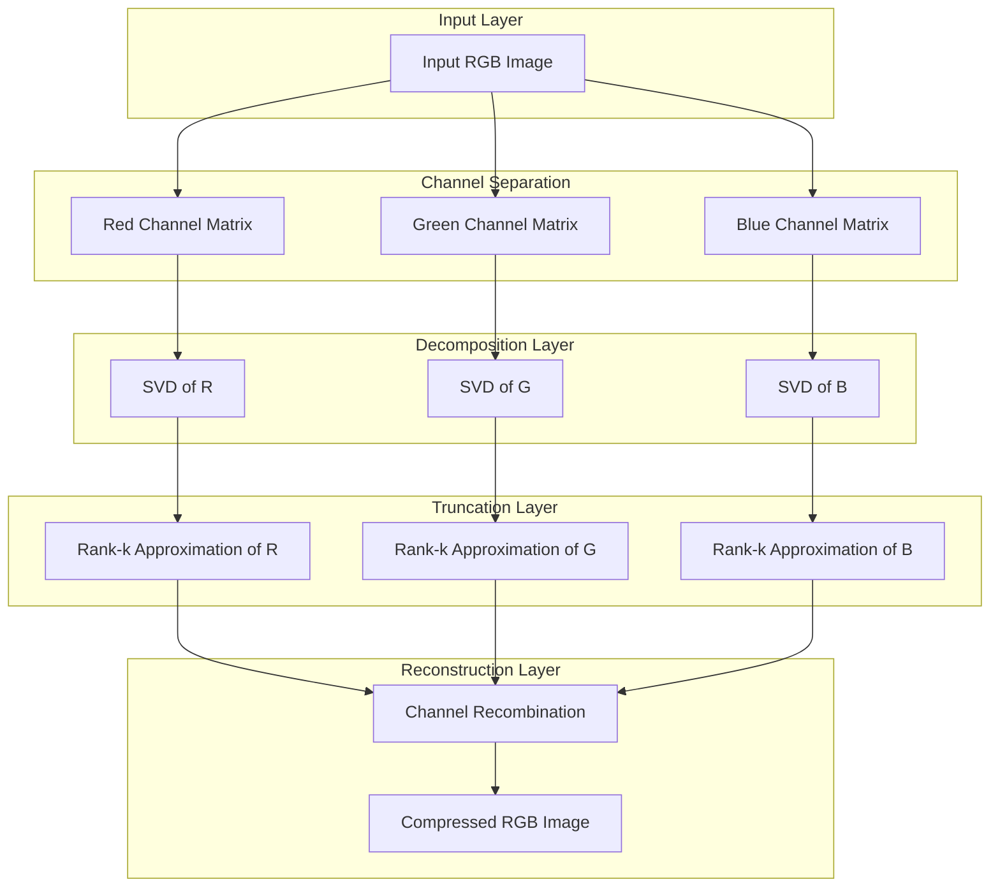

<div align="center">
  
</div>

---

# SVD-Based Image Compression via Low-Rank Approximation

The project demonstrates how Singular Value Decomposition (SVD) can be applied to color images to achieve low-rank approximation and lossy compression, analyzing the trade-off between the number of retained singular values and the visual fidelity of the reconstructed image.

<div align="left">

[](https://www.python.org/)
[](https://numpy.org/)
[](https://matplotlib.org/)
[](https://python-pillow.org/)
[](#methodology)
[](#)
[](#)
[](#)
[](https://opensource.org/licenses/MIT)

</div>

## Abstract

Digital images are naturally represented as matrices, and a large fraction of their information is often concentrated in a small number of dominant directions of variance. This project implements image compression through Singular Value Decomposition (SVD), decomposing each RGB channel of an image independently and reconstructing it using only the first *k* singular values and vectors. By varying *k* across multiple values, the project quantifies and visualizes how compression rank affects reconstruction quality, offering an intuitive, from-scratch demonstration of low-rank matrix approximation applied to real-world images.

## Table of Contents

1. [Overview](#overview) — Motivation and Problem Definition
2. [Methodology](#methodology) — Channel-Wise SVD and Rank-k Reconstruction
3. [Results and Analysis](#results-and-analysis) — Compression Rank vs. Reconstruction Quality
4. [Project Structure](#project-structure) — Repository Organization
5. [Usage and Installation](#usage-and-installation)
6. [License](#license)
7. [Author](#author)
8. [Support](#support)

# Overview

Singular Value Decomposition factorizes any matrix `A` into `U · Σ · Vᵀ`, ordering the singular values in `Σ` by their contribution to the matrix's total variance. Truncating this decomposition to the first *k* components yields the best possible rank-*k* approximation of the original matrix, which is the core principle exploited here for image compression.

The pipeline covers the full experimental cycle:

- Loading a color image and separating it into its Red, Green, and Blue channels
- Computing the full SVD of each channel matrix independently
- Reconstructing each channel using a truncated rank-*k* approximation
- Merging the approximated channels back into a single RGB image
- Repeating the process across multiple values of *k* to compare compression levels
- Visualizing the original image against each reconstruction side by side

---

# Methodology

The compression pipeline treats each color channel as an independent matrix and applies the same rank-truncation procedure to all three before recombining them into the final image.



For each channel matrix `A`, the full decomposition `A = U · Σ · Vᵀ` is computed, and the rank-*k* approximation is obtained as:

```python
A_k = U[:, :k] @ np.diag(sigma[:k]) @ Vt[:k, :]
```

The three reconstructed channels are then stacked back together to form the compressed image, which is displayed alongside the original for visual comparison. The procedure is repeated for `k = 50, 100, 150, 200`, allowing a direct, qualitative comparison of how compression aggressiveness affects perceptual image quality.

---

# Results and Analysis

Each input image is compressed at four rank levels (`k = 50, 100, 150, 200`) to observe the visual and structural trade-offs of low-rank approximation.

| Rank (k) | Retained Detail | Observed Effect |
| :-------- | :---------------- | :---------------- |
| 50       | Low              | Coarse structure preserved; fine textures and edges are noticeably blurred |
| 100      | Moderate         | Most perceptual details recovered; minor smoothing remains in high-frequency regions |
| 150      | High             | Reconstruction is visually near-identical to the original |
| 200      | Very High        | Reconstruction is virtually indistinguishable from the original image |

### Observations

- As *k* increases, the reconstructed image rapidly converges toward the original, confirming that most of the visual information is captured by a relatively small number of dominant singular values.
- Lower-rank reconstructions preserve global structure (shapes, contours) while sacrificing fine texture, which is consistent with the theoretical property that the largest singular values correspond to the most energy-dense components of the matrix.
- The method achieves effective compression without any specialized image codec, relying purely on linear algebra.

---

# Project Structure

```
SVD-Based-Image-Compression
│
├── svd_image_compression.py
│
├── input_images/
│   ├── 1.PPM
│   ├── 2.PPM
│   ├── 3.PPM
│   └── 4.PPM
│
├── output_images/
│   ├── 1/
│   ├── 2/
│   ├── 3/
│   └── 4/
│
└── README.md
```

---

# Usage and Installation

```bash
# 1. Clone the repository
git clone https://github.com/ParmidaGh/SVD-Based-Image-Compression.git
cd SVD-Based-Image-Compression

# 2. Create and activate virtual environment
conda create -n svd-compression python=3.10
conda activate svd-compression

# 3. Install required packages
pip install numpy matplotlib pillow
```

Update the image path inside `svd_image_compression.py` to point to an image in `input_images/`, then run the script to generate the side-by-side original vs. compressed comparisons for each rank level.

---

# License

This project is licensed under the MIT License.

---

## Author

**Parmida Ghamari**
M.Sc. Student, University of Tehran
Research Assistant @ Social Networks Lab

**Research Interests:** Data Mining, Numerical Linear Algebra, Dimensionality Reduction, Image Processing, Machine Learning

📧 [Parmida.ghamari@gmail.com](mailto:Parmida.ghamari@gmail.com) | 💻 [github.com/ParmidaGh](https://github.com/ParmidaGh) | 💼 [linkedin.com/in/parmida-ghamari](https://www.linkedin.com/in/parmida-ghamari)

---

# Support

If you find this project useful, consider giving it a star ⭐

---

<p align="center">
Built using NumPy, Matplotlib, and Pillow
</p>
